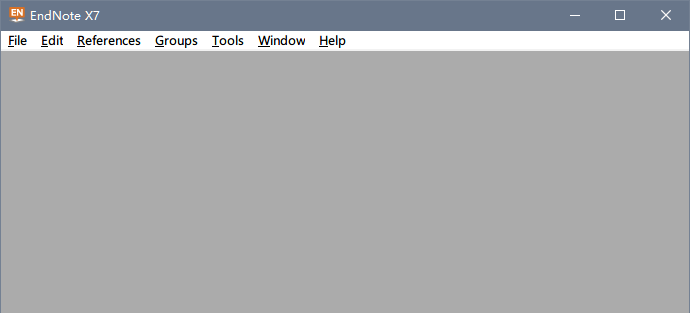
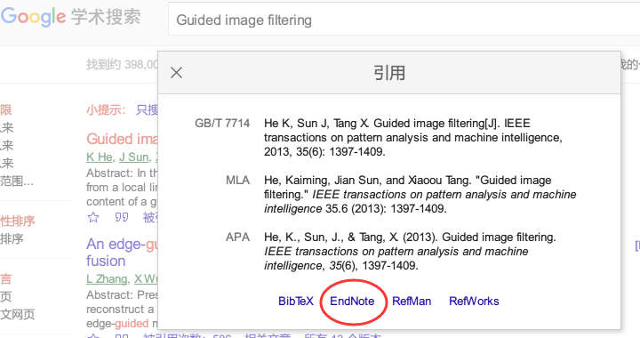
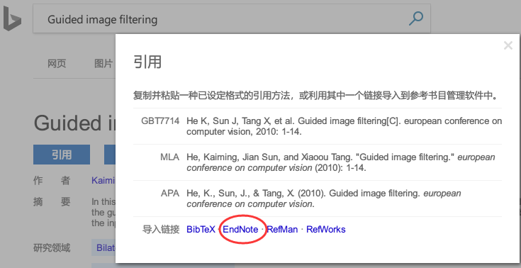
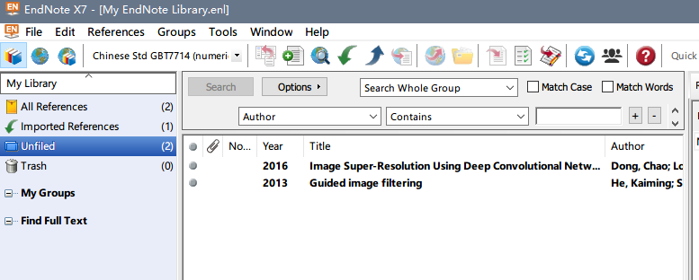
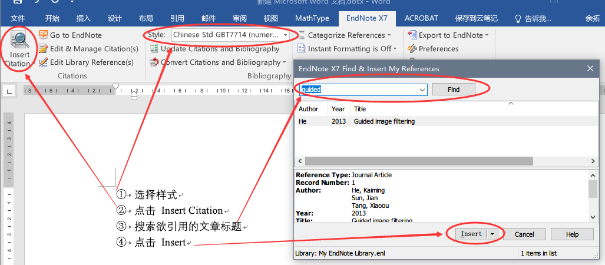
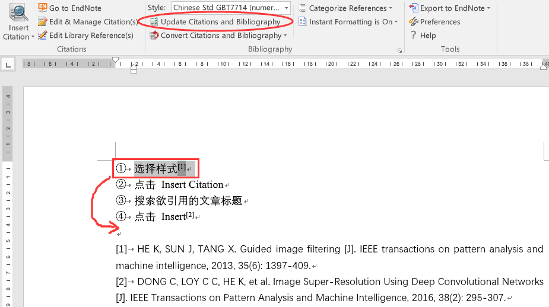
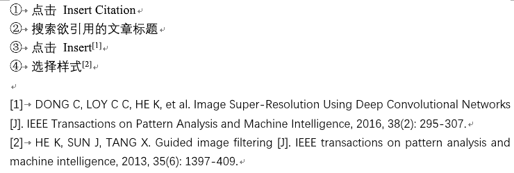

# EndNote 入门

首次提交：2017-11-30 by [🐟](https://github.com/tyusr)

## 引言

EndNote 作为一款功能强大的文献管理软件，绝对是提高论文写作效率的利器。特别是对于毕业论文这种，动辄包含五、六十个参考文献的长篇幅论文来说，手工编排引文简直是一场噩梦。此时引文自动编排的功能，就显得尤为重要了。

## 首次使用

安装完 EndNote 之后，首次打开它，会看到一个空空如也的界面。

因为此时 EndNote 还没有加载任何 Library。

点击 **File** -> **New**，可在指定路径下新建一个 Library，它的形式是一个 **.enl** 文件和一个以 **.Data** 为后缀的文件夹。保管好这个两个东西，因为后续步骤导入的文献资料都会存放在这里。

## 导入文献

谷歌学术、bing学术以及国内的一票搜索引擎，基本上都提供了 EndNote 格式的引文：

谷歌：

必应：

点击后下载，得到 **.enw** 格式的文件。双击打开后，引文内容会自动导入到 EndNote 中：

界面左侧的面板可以对已导入的文献进行分类。中间的主面板显示了论文的部分信息。不在这里赘述。

## 添加引用

新建一个 word 文档，试着向文本中插入文献引用：

(1) 选好引文的 style（样式），中文文献一般要求 GBT-7714。（这个 style 在 EndNote 中默认是没有的，好在这个 style 文件在网上一找一大把。找到以后放在 EndNote 安装目录的 Styles 文件夹下）

(2) 点击左上角的 **Insert Citation** 按钮，弹出一个搜索窗口；

(3) 搜索想要引用的论文；

(4) 点击 **Insert** 插入引用。

这样就 OK 了。

## 更新引文

再插入一个引文，试一试引文位置变化后，EndNote 能不能自动重新编号。下图文字中，①和④分别引用了文献[1]和[2]。我们将①部分的文字剪切粘贴到④的后面，然后点击 Word 面板上的 **Update Citations and Bibliography**：

更新之后如下图。可以看到 EndNote 自动重新编排了引文的序号和位置。

